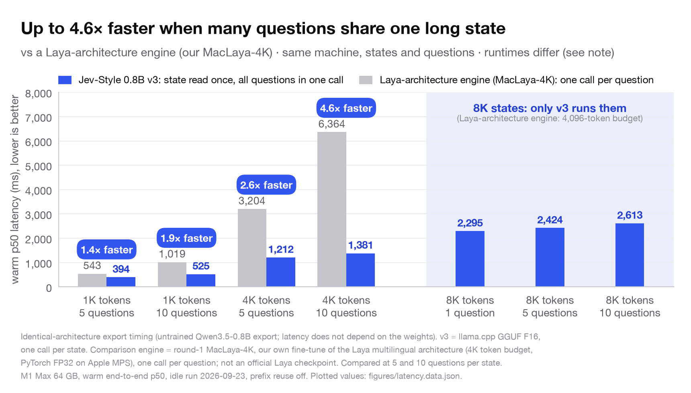

# Jev-Style-0.8B-Decision-v3-GGUF

**Jev-Style decision series:** [v1 · 2B](https://huggingface.co/chaoliangUNSW/Jev-Style-Qwen3.5-2B-Decision-GGUF) → [v2 · 2B](https://huggingface.co/chaoliangUNSW/Jev-Style-Qwen3.5-2B-Decision-v2-GGUF) → **v3 · 0.8B** · **Website:** [jevstyle.com](https://jevstyle.com/#v3)

**Jev-style decisions on your laptop.** These are the GGUF builds of [Jev-Style-0.8B-Decision-v3](https://huggingface.co/chaoliangUNSW/Jev-Style-0.8B-Decision-v3) for llama.cpp: **0.53 GB** in 4-bit (Q4_K_M), with the same decision as full precision on 240 of 240 parity rows. Full results, protocols, training data and licences are on the [main model card](https://huggingface.co/chaoliangUNSW/Jev-Style-0.8B-Decision-v3).


| | **Jev-Style v3 · 0.8B** | Laya typed | Jev (API) |
|---|:---:|:---:|:---:|
| Typed decisions, accuracy ↑ | **79.2%** | 76.6% | 72.7%¹ |
| Probability error, Brier ↓ | **0.046** | 0.061 | 0.148¹ |
| Runs on your own machine | **Yes, 0.53 GB (4-bit)** | Yes | No, API only |
| Longest input per call | **25,600 tokens** | 1,024 by default² | not published |

<sub>¹ Same 2,000 typed decisions (LocalLLaMA/typed-decisions). v3 and Laya typed were trained on its train split; Jev is zero-shot, with numbers from the dataset card. Protocol and paired confidence intervals: see the [main model card](https://huggingface.co/chaoliangUNSW/Jev-Style-0.8B-Decision-v3#typed-decisions-08b-beats-the-2b-models-and-jev). ² Default input budget in the Laya README: 1,024 tokens for the multilingual and typed checkpoints, 512 for English.</sub>

**Reads long documents in one call.** Up to 25,600 tokens of input, 25× Laya's 1,024-token default and 25× our 2B v2's prompt. On 1,280 real 24K-token items v3 answers **98.3%** correctly, and accuracy stays flat from 1K to 24K tokens (preregistered claim, passed).

**Also:** +30.3 points over the best official Laya checkpoint on model routing · ahead of Laya multilingual in 51 of 51 languages.


## Files

| File | Quantization | Size | Same decision as PyTorch FP32 (240 parity rows) | Prompts of about 16K / 25.6K tokens |
|---|---|---:|---:|---:|
| `Jev-Style-0.8B-Decision-v3-F16.gguf` | F16 | 1.52 GB | **240 / 240** | **6 / 6** |
| `Jev-Style-0.8B-Decision-v3-Q8_0.gguf` | Q8_0 | 0.81 GB | **240 / 240** | **6 / 6** |
| `Jev-Style-0.8B-Decision-v3-Q4_K_M.gguf` | Q4_K_M | 0.53 GB | **240 / 240** | **6 / 6** |

<sub>Top-1 agreement with the PyTorch FP32 reference on a 240-row mixed parity fixture (training-pool rows, 22 categories, English and Chinese) plus 6 extra long prompts. These rows test agreement between formats, not accuracy. Sizes are the exported files (GB = 10^9 bytes). F16 is the runtime's default and the backend used for the latency figures.</sub>

## Quick start

The files are standard Qwen3.5 text models, so any recent llama.cpp loads them. Chat or text generation does
**not** give you the model's decisions, though. Decisions are read at one verdict slot per option, and the bundled
scorer does exactly that.

```bash
pip install -U huggingface_hub
hf download chaoliangUNSW/Jev-Style-0.8B-Decision-v3-GGUF --local-dir jev-v3-gguf
cd jev-v3-gguf
pip install -r requirements.txt                 # tokenizers, numpy

# Build the scorer against llama.cpp (tested at commit 441df11f65ea0b6d0c72965aaf70c8241070ddcb or later).
git clone https://github.com/ggml-org/llama.cpp
git -C llama.cpp checkout 441df11f65ea0b6d0c72965aaf70c8241070ddcb
sh build_jev_score.sh llama.cpp                 # -> ./build/jev-score (Metal on macOS)
# Linux + CUDA: LLAMA_CMAKE_FLAGS="-DGGML_CUDA=ON" sh build_jev_score.sh llama.cpp

python jev_style_decision_gguf.py --quant Q4_K_M \
  --state "The film was excellent." \
  --question "What is the sentiment of this review?" \
  --options '["negative", "positive"]' --category general_sentiment
```

From Python, the API is the same as the main repository's runtime:

```python
from jev_style_decision_gguf import JevStyleDecisionGGUF

m = JevStyleDecisionGGUF(".", quant="F16")      # or "Q8_0", "Q4_K_M"
r = m.decide(
    {"ticket": "I was charged twice for my subscription this month.", "customer_tier": "pro"},
    "Which team should handle this ticket?",
    options={"billing": "payments, invoices, refunds", "technical": "bugs and outages", "sales": "new purchases"},
    category="theme_routing",
)
print(r["answer"], r["probabilities"])
m.close()
```

- `jev-score` (`jev_score.cpp`) is a small libllama program that runs as a JSON-lines process. It requests logits
  only at the slot positions. With a shared prefix it decodes the state once and scores several questions on
  copies of it.
- `decide_many` sends all questions about one state in one request. The default, `many_mode="exact"`, returns
  exactly what one `decide` call per question returns; it shares the state in whole 1,024-token blocks, so it
  saves time from 1,024-token states on. `many_mode="batched"` reads the whole state once and scores all questions
  together (the setting of the latency chart); its probabilities differed from `decide` by at most 0.002 in our
  tests, and a near-tied top answer can change.
- The runtime opens a 32,768-token context, which covers the 25,600-token input limit plus the question part.
  The whole input may be up to 25,600 tokens, and the question, options and readout up to 2,048. Over-budget
  inputs raise an error, and nothing is truncated.
- The input format, the readout and the calibration temperatures are described on the
  [main card](https://huggingface.co/chaoliangUNSW/Jev-Style-0.8B-Decision-v3#input-format-and-readout).

<details>
<summary><strong>Results and speed</strong></summary>

- **4-bit, 0.53 GB, same calls.** The Q4_K_M file matches PyTorch FP32 on 240 of 240 parity rows, plus 6 of 6
  prompts at about 16K and 25.6K tokens, and it is about 2.4× smaller than the 2B v2's Q4_K_M (1.27 GB).
- **Up to 4.6× faster than a Laya-architecture engine when 10 questions share one 4K-token state** (1,381 ms vs
  6,364 ms with `many_mode="batched"`; the engine is our round-1 MacLaya-4K, one call per question, not an official
  Laya checkpoint), because in that mode the bundled scorer reads the state once. It also answers questions about 8K-token states in 2.3 to 2.6 s.
- **79.2% on 2,000 typed decisions**, +6.4 points over Jev and +5.7 over the 2B v2, with a 3.2× lower Brier score
  than Jev (in-domain for v3, zero-shot for Jev).




<sub>Latency: untrained identical-architecture Qwen3.5-0.8B export on llama.cpp GGUF F16, one call per state with all questions scored together (`many_mode="batched"`); comparison engine = round-1 MacLaya-4K, our own fine-tune of the Laya multilingual architecture (FP32 on Apple MPS, 4,096-token budget, one call per question), not an official Laya checkpoint; Apple M1 Max 64 GB, warm p50, idle run 2026-09-23. v3 parity rows are drawn from the training pool; 2B v1/v2 quantization numbers and sizes are as reported on their public GGUF cards (their own 500 held-out decisions), so no agreement gap is claimed. More protocol detail is on the main card.</sub>

</details>

## Licence

Apache-2.0. Built on Qwen/Qwen3.5-0.8B (Apache-2.0). Some training data has restrictive or unclear terms, and some
training rows are outputs of OpenAI and Anthropic models. See "Training data and licences" on the main card.
Not affiliated with TypeSafe AI, Jev, the Laya authors or the Qwen team.

## Contact

I welcome internship, employment, and research collaboration opportunities. Please contact me at [**yanchaoliang369@gmail.com**](mailto:yanchaoliang369@gmail.com).

欢迎提供实习、工作及科研合作机会，请邮件联系：[yanchaoliang369@gmail.com](mailto:yanchaoliang369@gmail.com)。
